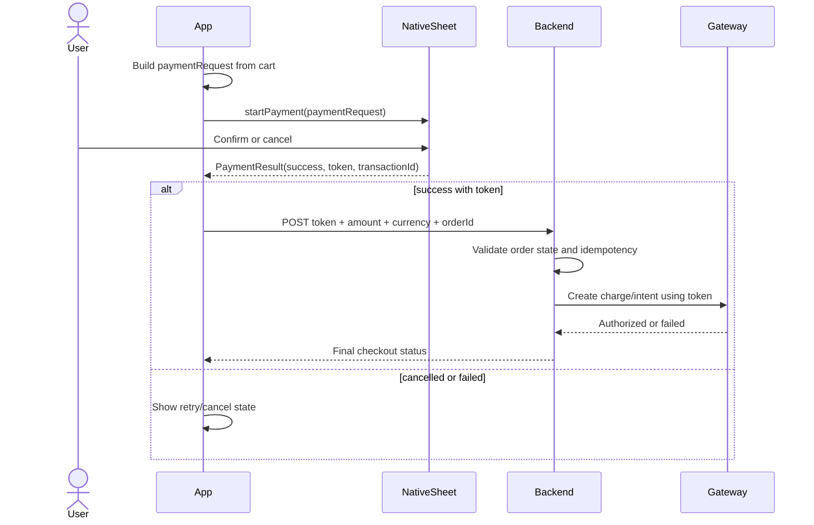

# Payment flow (end-to-end)

This page focuses on runtime behavior and integration boundaries so you can make your checkout resilient.

## Overview

The library does **not** charge the user directly. It opens the native wallet sheet, returns a tokenized payment payload, and lets your backend complete the charge with your gateway.

At a minimum:

1. App checks wallet availability (`canMakePayments` / `payServiceStatus()`).
2. App builds a `PaymentRequest` from cart items.
3. User confirms payment in the native sheet.
4. App receives `PaymentResult` (`success`, `token`, optional `transactionId`).
5. Backend validates order context and charges through your provider.

## Runtime sequence

## PaymentResult outcomes

### 1) Success

- `result.success === true`
- `result.token` is present and should be forwarded to your backend.
- Your client should still wait for backend confirmation before marking the order paid.

### 2) Native flow completed but failed

- `result.success === false` with `result.error`.
- Treat this as a completed wallet flow with a failed outcome (not a thrown exception).
- Show a recoverable UI (retry, choose another method).

### 3) Start/processing exception

- `startPayment()` may return `null` when an exception occurs.
- The hook also sets `error` in state.
- Handle this as an app/runtime failure path (show generic error + retry).

### 4) Empty cart

- Calling `startPayment()` with no cart items returns `null` and sets a "Cart is empty" error.
- Gate the pay button on `items.length > 0`.

## Token format

`PaymentToken.paymentData` is an opaque gateway payload and is **platform/gateway-dependent**:

- **Apple Pay (iOS):** Base64-encoded data from the Apple Pay token payload.
- **Google Pay (Android):** Tokenization payload from Google Pay (`tokenizationData.token`), whose schema depends on your configured gateway.

Always send the **entire token object** (or exactly the fields your gateway asks for) to your backend. Avoid parsing or transforming token payloads in the client.

## Server responsibilities (required)

Your backend should:

- Validate order ownership, amount, and currency from server-side order data.
- Use an idempotency key (for example `transactionId` + `orderId`) to prevent duplicate charges.
- Call gateway APIs with the provider-specific token mapping.
- Persist both wallet result and gateway result for audit/debug.
- Return a final, app-friendly checkout status.

## Before production

- [ ] **iOS:** Merchant ID and Payment Processing Certificate set up and installed in your gateway.
- [ ] **Android:** Google Pay API enabled; production gateway merchant ID and environment configured.
- [ ] **Backend:** Endpoint validates the token, amount, and context and uses the gateway SDK to create the charge.
- [ ] **Security:** Never log or expose raw token payloads; use HTTPS and secure storage for any sensitive data.

Next: [API: usePaymentCheckout](/docs/api/use-payment-checkout) or [Server-side processing](/docs/guides/server-processing).
